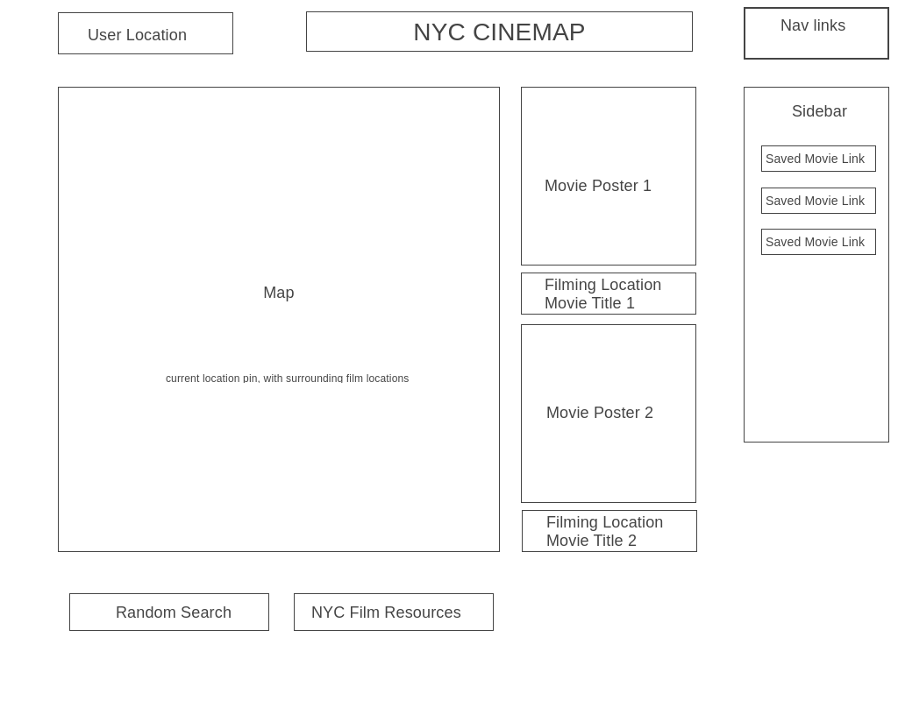

#JS Project Proposal
####Dave Woolner
Aug, 12th, 2021     

  # ***NYC Cinemap*** 
  ### a NYC Film Production Map App

### Background
As a veteran of the NYC film industry, my goal with this app is to shine a light on moments of cinematic history that may be right around the corner from you.

Thanks to the NYC Mayor's Office in providing their dataset "Scenes from the City", which offers latitude and longitude of about 200 films, the aim of this app is to draw from the user's current location (somewhere in NYC), and populate the site with several of the titles that were filmed just blocks away. The user can then see title, and trivia information regarding the film, and with some kind of data persistence, be able to save these films to a list with links to sites where they may be viewed. 

### Functionality & MVPs

Users will be able to:

- Provide access to their current location or enter a location, so they can be found on the map. Map will be provided by an API, most likely Mapbox.

- Upon finding the users location, the map will zoom into a radius encompassing several blocks, and drop pins on the surrounding film locations. 

- Films' data will be fetched from an IMDB-like API, and populate the interface with the movie details, images, links, etc.

###  Additionally

-  It would be great to be able to persist a list of the movies to be watched. I'm thinking the user can save any or all of the movies by ids in local storage and fetch it to repopulate the list when the user revisits the site. 

- Any stills from the location would be great to find and highlight as well. 

	
  
###  Technologies, Libraries, APIs

- Mapbox GL JS library to render the map that will feature a pin for the users location as well as surrounding film locations.

- TMDB API, for getting film details

- Navigator API, for getting user's location data

- Webpack to bundle

- "Scenes from the City" XML dataset: https://data.cityofnewyork.us/Business/Filming-Locations-Scenes-from-the-City-/qb3k-n8mm

- LocalStorage API for persisting a list of movies our user would like to see. 

- Font awesome for pin icons.

- Google fonts for, well, fonts.

- Possible backend for persisitng API tokens.

###  Implementation Timeline

- ***Friday and weekend***:
    research the various APIs I'll be using, and understand how to implement them. Do we need a backend for API tokens? Get very familiar with Postman and be able to fetch all the data. Be able to grab location data from user. Clean and get NYC dataset ready for use.

- ***Monday***: Begin getting the map, and visuals on the page. Basic layout of elements. Move on to event handlers and JS functionality.

- ***Tuesday***: Map functionality should be close to finished. We want to be able to be zoomed in on our user's target, and get some sort of pin to represent the surrounding films. Film data populates. Work on styling, and getting layout cleaned up. 

- ***Wednesday***: Continue tweaking css. Work on localStorage to persist a list of movies to be watched. Deploy to server.

###  Bonus Features:

- media queries for mobile friendly viewing

- if another dataset for film locations is available, it's possible we could expand beyond NYC.

- stream the film! 

- links to NYC film resources 

- film trivia
